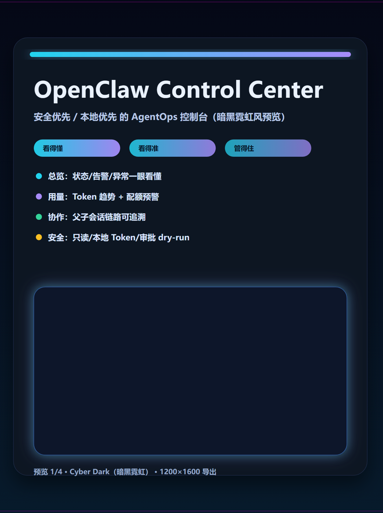
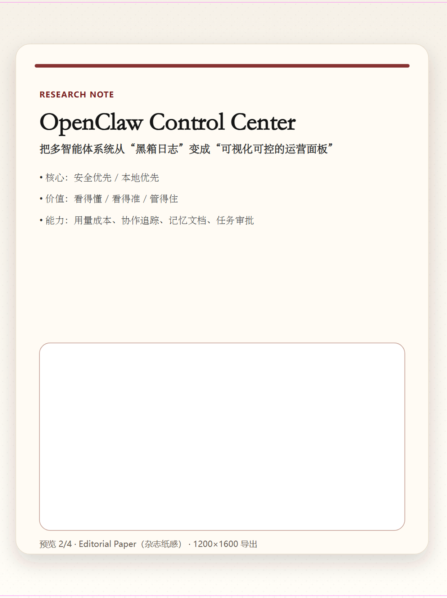
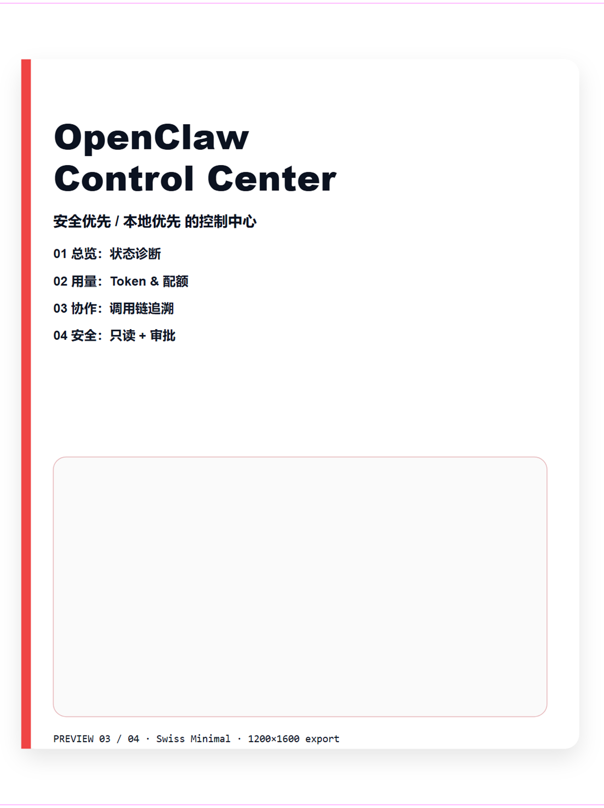
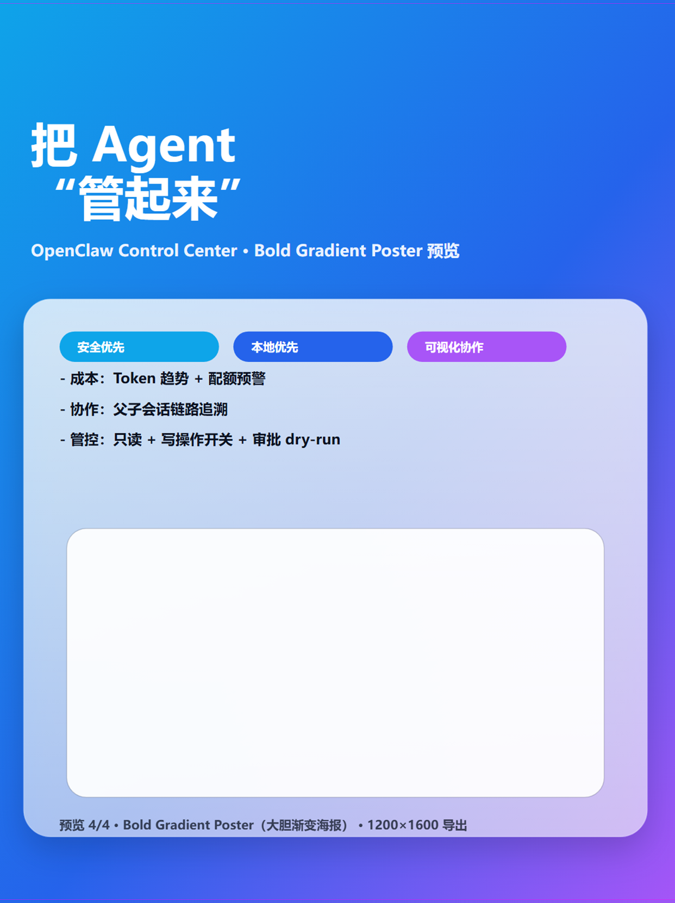

# xhs-link-to-card-pipeline

把“链接 / 文档”转换成“小红书可发布素材包”：结构化摘要、系列 SVG 知识卡片、PNG 发布图、发布文案（标题/标签/简介/正文骨架/CTA）。

## 示例预览（4 种风格）
下面是同一主题在 4 种风格下的封面预览（用于“先选风格再制作”）：

| Cyber Dark（暗黑霓虹） | Editorial Paper（杂志纸感） |
|---|---|
|  |  |

| Swiss Minimal（瑞士极简） | Bold Gradient Poster（大胆渐变海报） |
|---|---|
|  |  |

## 目录说明
- `SKILL.md`：Skill 工作流与卡片规范（包含“先选风格”与“满铺无留白”要求）
- `agents/openai.yaml`：Codex Skill 元信息
- `scripts/convert_svg_to_png.ps1`：SVG → PNG（强制输出 `1242x1660`，避免留白/黑边）

## 本地转换（SVG → PNG）
在包含 `.svg` 的目录运行：

```powershell
powershell -ExecutionPolicy Bypass -File scripts/convert_svg_to_png.ps1
```

默认输出到 `png_output/`。
