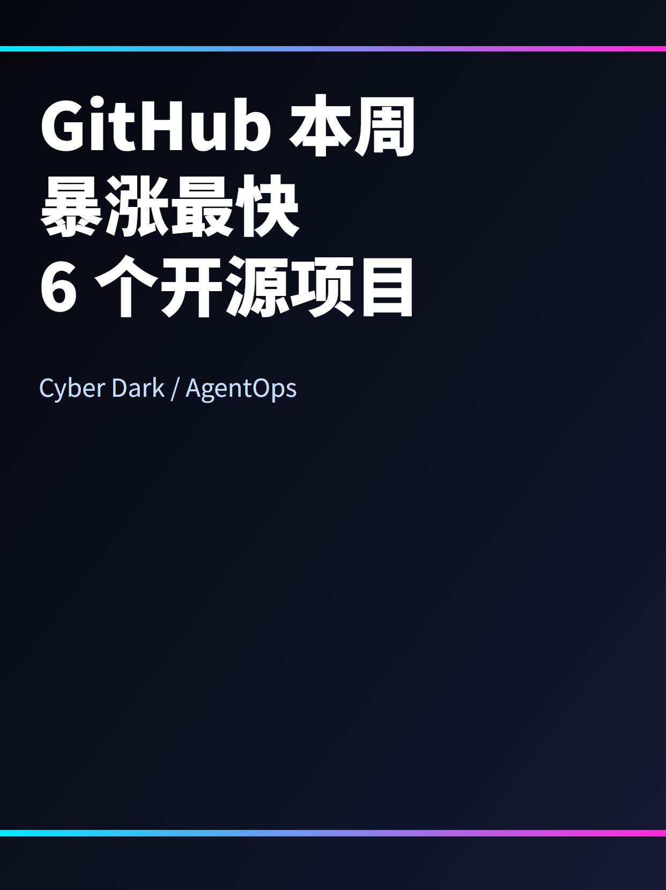
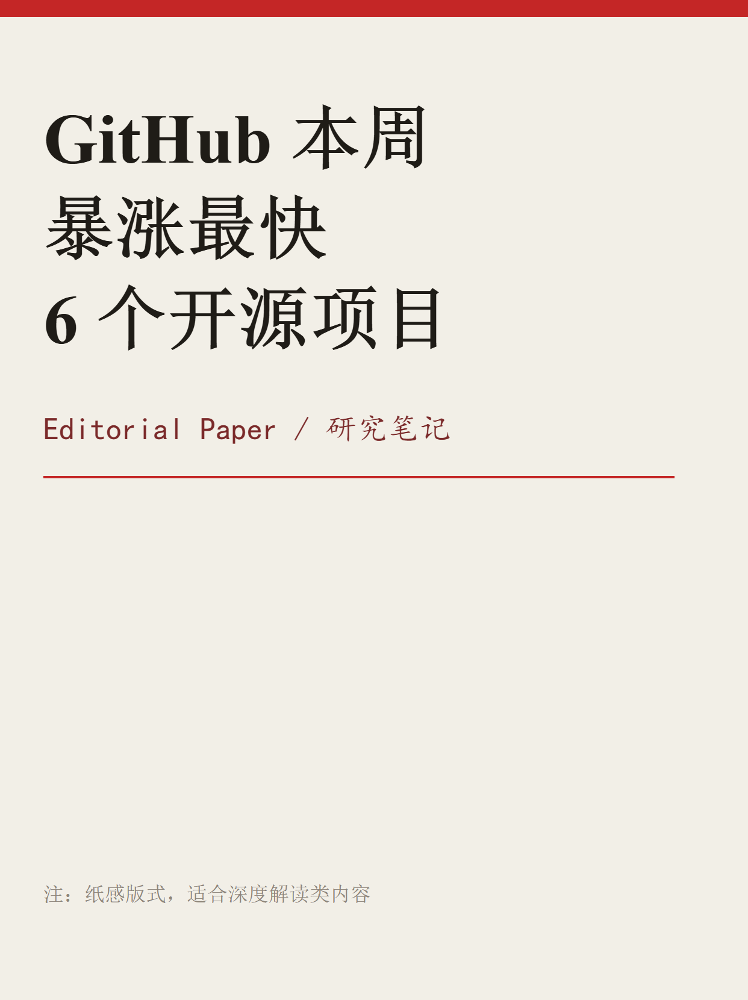
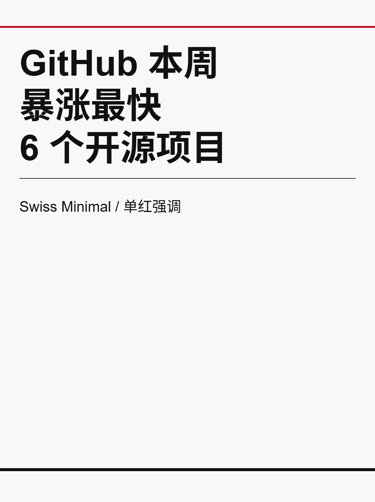
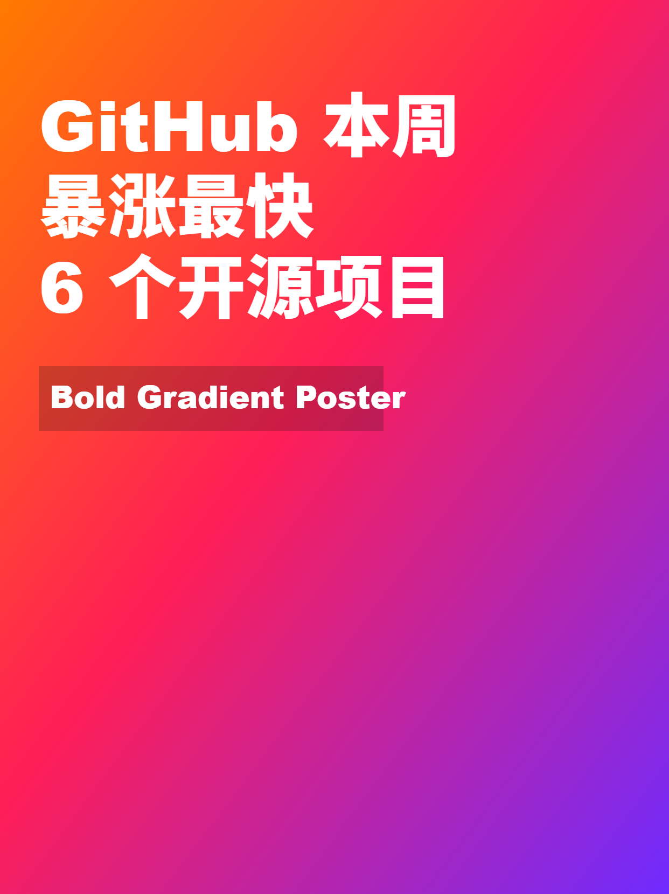
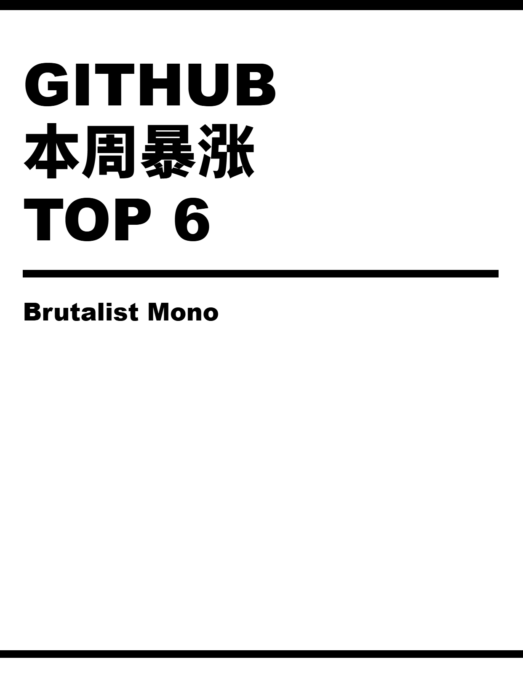
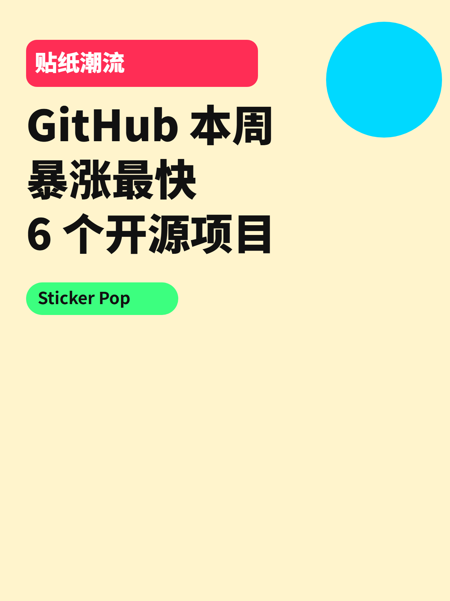
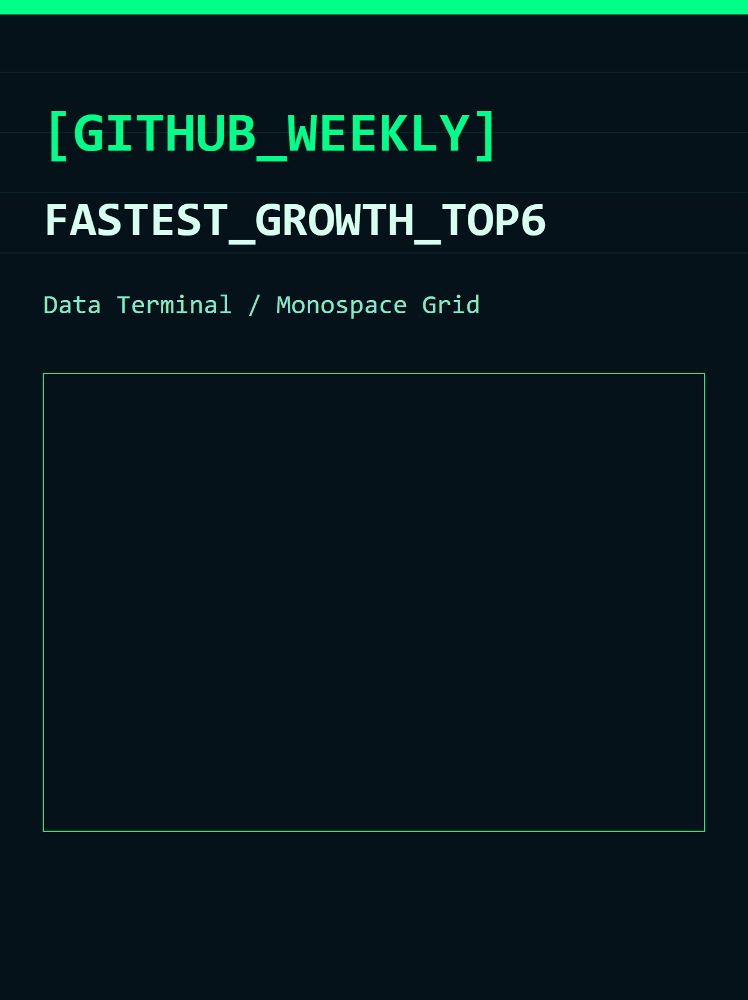
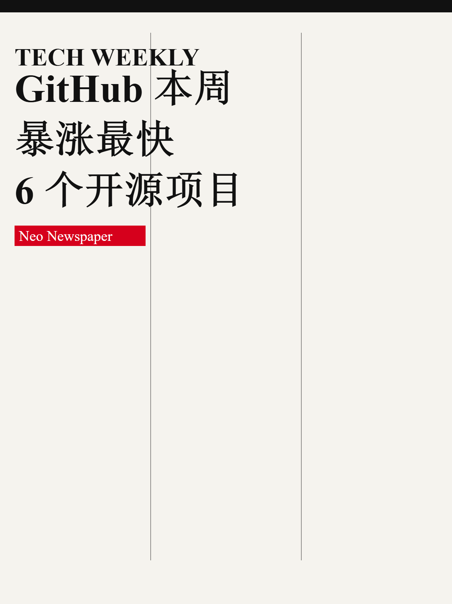

# xhs-link-to-card-pipeline

把“链接 / 文档”转换成“小红书可发布素材包”：结构化摘要、系列 SVG 知识卡片、PNG 发布图、发布文案（标题/标签/简介/正文骨架/CTA）。

## About
这是一个 Codex Skill 仓库，用于把「链接/本地 Markdown」快速转成可直接发布的小红书资产包，并且内置 8 套差异化风格预设（先选风格 → 再生成全套卡片）。

## 风格预览（8 种风格）
下面是同一主题在 8 种风格下的封面预览（用于“先选风格再制作”）：

| Cyber Dark（暗黑霓虹） | Editorial Paper（杂志纸感） |
|---|---|
|  |  |

| Swiss Minimal（瑞士极简） | Bold Gradient Poster（大胆渐变海报） |
|---|---|
|  |  |

| Brutalist Mono（野性单色） | Sticker Pop（贴纸潮流） |
|---|---|
|  |  |

| Data Terminal（终端数据感） | Neo Newspaper（新报纸） |
|---|---|
|  |  |

## 目录说明
- `SKILL.md`：Skill 工作流与卡片规范（包含 8 套风格 DNA、模板池规则与验收清单）
- `agents/openai.yaml`：Codex Skill 元信息
- `scripts/convert_svg_to_png.ps1`：SVG → PNG（内置验收与边缘修复）
- `scripts/reexport_crop.ps1`：放大截图后固定裁切（稳定去除右/下边带）
- `scripts/reexport_no_border.ps1`：调用主导出脚本的便捷封装

## 本地转换（SVG → PNG）
在包含 `.svg` 的目录运行：

```powershell
powershell -ExecutionPolicy Bypass -File scripts/convert_svg_to_png.ps1
```

默认输出到 `png_output/`。

推荐使用稳定裁切导出（跨任务更稳）：

```powershell
powershell -ExecutionPolicy Bypass -File scripts/reexport_crop.ps1 -InputDir output/svg -OutputDir output/png_output
```

## 验收与排错（新增）
导出脚本内置验收，会自动检查：
- 尺寸是否为 `1242x1660`
- 边缘连续性是否正常（适配渐变背景）
- 是否存在右侧/底部极端边带（白边/黑边断层）

如只做验收（不重新导出）：

```powershell
powershell -ExecutionPolicy Bypass -File scripts/convert_svg_to_png.ps1 -InputDir output/svg -OutputDir output/png_poster -ValidationOnly
```

如仍发现边缘断层，优先检查：
- SVG 是否首层有满铺背景 `rect`
- 画布是否严格 `1242x1660`
- 是否误用了 `contain` 导致 letterbox
- 是否应改用 `reexport_crop.ps1` 做几何裁切导出
